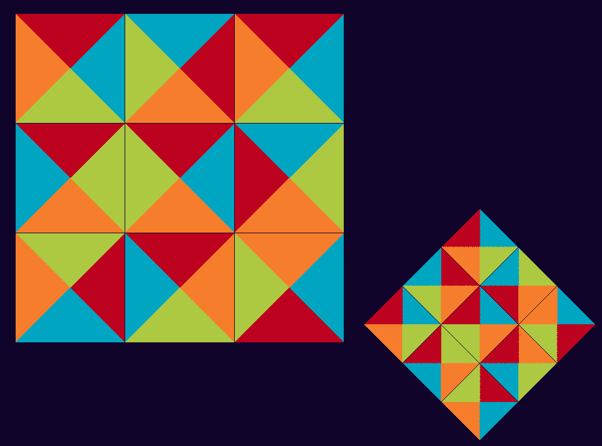
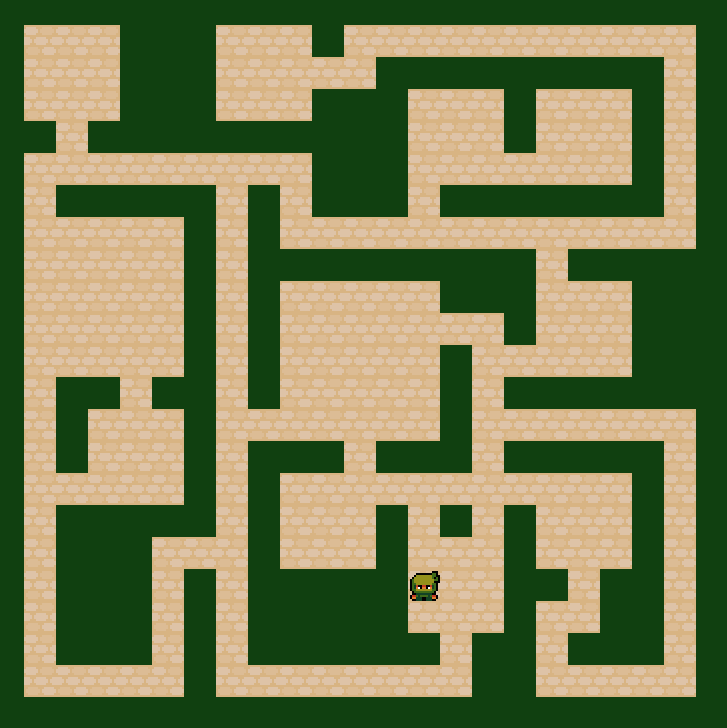

*~ WARNING: this repository is no longer maintained by its author ~*

The previous open-source software *coremon engine* has been superseded by the tool:

## Katagames SDK

The new tool provides game developers with more interesting features and structures, but also useful actions related to game development and game publishing +the ability to run games in a web context.

To learn more about the **Katagames SDK** and the associated python package `katasdk`, please check this Github repo:

[gaudiatech/katasdk-public](https://github.com/gaudiatech/katasdk-public)

### How it all started?

I've had the dream of being able to create python games efficiently, in such a way that it greatly simplifies code reuse and readability.

### coremon pre-requisites
+ Python 3.7 or higher
+ pygame1.9.6 or higher

The engine may run properly with earlier versions, although I cannot guarantee this behaviour

### long-term objective
optimize the production process of indie games meant to be published via the new https://kata.games platform

### preview / basic examples

### principles / engine features
- uses the MVC design pattern
- event-driven engine
- allows for easy definition of your own events
- comes bundled with a set of handy tools:
SpriteSheet, RandomMaze for level generation, DijkstraPathfinder for pathfinding, etc.

### credits / creation date
authors (c)
- Thomas "wkta" Iwaszko
- Phil Hassey

The coremon engine development started somewhere around august 2018.
The gui module by Phil Hassey, is older and has been borrowed to ease the creation of popups, buttons, etc.

See LICENSE for license information.
